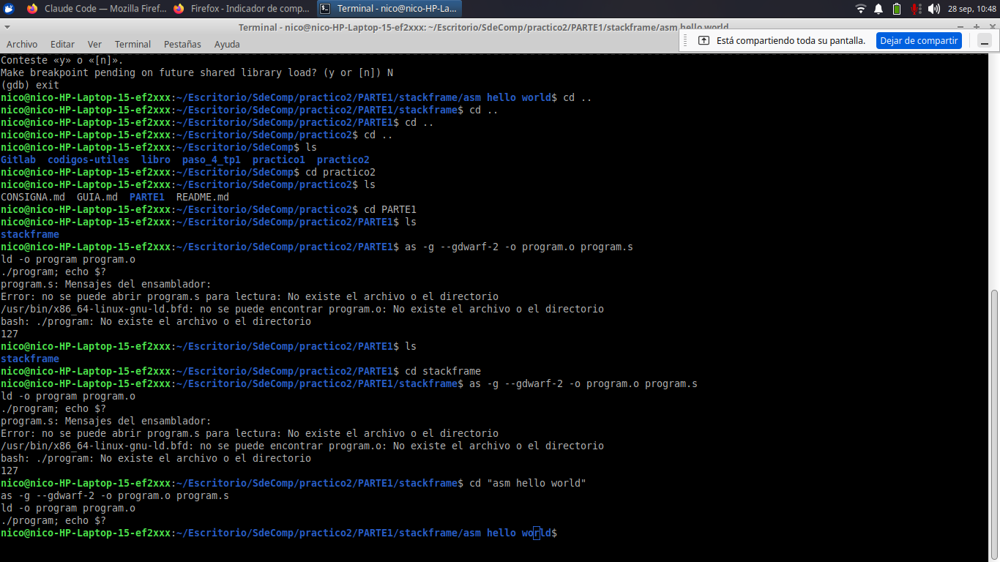
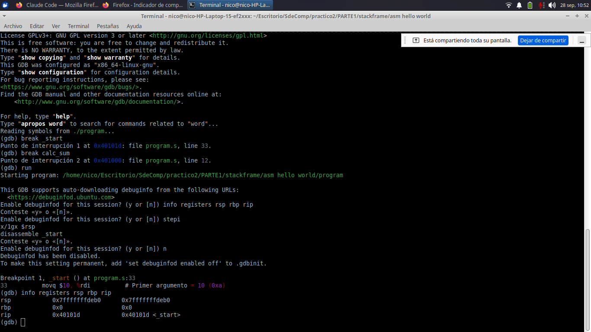
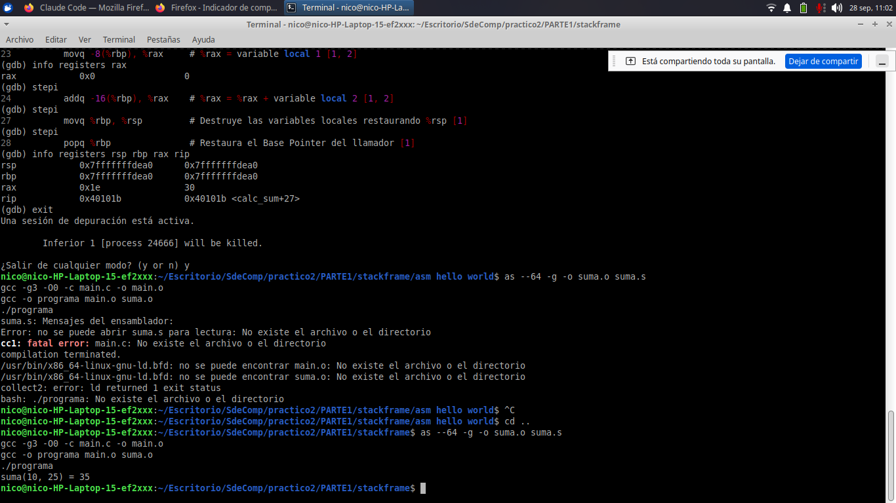
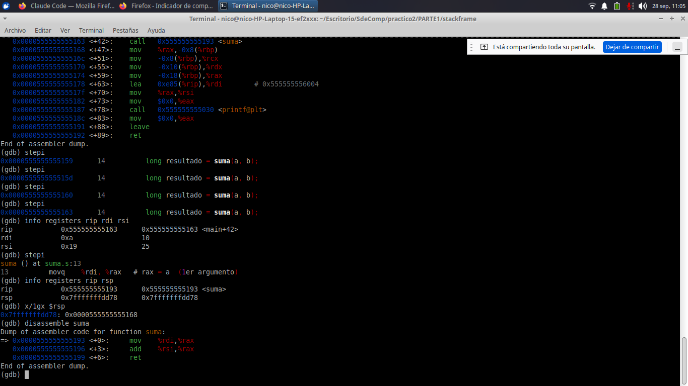

# Procedimiento

Registro paso a paso de lo que fuimos haciendo, con las capturas que verifican cada
resultado. Se lee en orden. A medida que avanzamos con el trabajo práctico se van
agregando las partes siguientes a este mismo documento.

La teoría que hay detrás de todo esto está en [`GUIA.md`](GUIA.md); los requisitos del
trabajo y el plan de etapas, en [`CONSIGNA.md`](CONSIGNA.md).

---

# Parte 1 — Stack frames en x86-64 con GDB

El objetivo de esta parte es **ver con nuestros propios ojos** cómo se arma y se desarma
el marco de pila de una función: dónde quedan los argumentos, quién pone la dirección de
retorno y qué hacen exactamente el prólogo y el epílogo.

Es el paso previo obligatorio al TP, porque la consigna pide pasar los parámetros **por
el stack** — y antes de forzar eso hay que poder observarlo.

Trabajamos sobre el material del profesor:
<https://gitlab.com/nicoborsottib/stackframe>

---

## 1. Preparar el entorno

```bash
sudo apt install build-essential gdb
```

`build-essential` trae `gcc` (compilador de C), `as` (ensamblador) y `ld` (enlazador).

Verificamos que esté todo:

```bash
uname -m        # tiene que decir x86_64
gcc --version
as --version
gdb --version
```

## 2. Clonar el material del profesor

```bash
git clone https://gitlab.com/nicoborsottib/stackframe.git
```

El repositorio tiene los archivos repartidos en dos lugares, y conviene tenerlo claro
porque es fácil equivocarse de carpeta:

| Dónde | Qué hay | Para qué |
|---|---|---|
| `stackframe/asm hello world/` | `program.s` | Parte A: ensamblador puro |
| `stackframe/` (raíz) | `main.c`, `suma.s` | Parte B: C llamando a ensamblador |
| `stackframe/` (raíz) | `main2.c`, `suma2.s`, `suma_por_pila.s` | Parte 2 |

---

# Parte A — Una función en ensamblador puro

`program.s` no usa la biblioteca de C. Su punto de entrada `_start` llama a
`calc_sum(10, 20)`, que se arma su propio marco de pila, guarda los argumentos como
variables locales, los suma y devuelve el resultado. El programa termina con la syscall
`exit` usando ese resultado como código de salida.

## 3. Compilar y ejecutar

```bash
cd stackframe/"asm hello world"
as -g --gdwarf-2 -o program.o program.s
ld -o program program.o
./program; echo $?
```

Las comillas en `"asm hello world"` son necesarias porque el nombre de la carpeta tiene
espacios.

Dos detalles de los comandos:

- **`-g --gdwarf-2`** incorpora la información de depuración. Sin esto, GDB después no
  nos muestra el código fuente.
- Enlazamos con **`ld`** directamente, no con `gcc`, porque el programa no necesita la
  biblioteca estándar de C.

El programa no imprime nada por pantalla: devuelve **30** (que es 10 + 20) como código de
salida. Por eso lo consultamos con `echo $?`.



## 4. Abrir el depurador

```bash
gdb ./program
```

Si GDB pregunta si querés habilitar *debuginfod*, contestá **`n`**: descarga símbolos
desde internet y acá no hacen falta, porque nuestro binario ya trae los suyos.

Para que no vuelva a preguntar nunca más:

```bash
echo "set debuginfod enabled off" >> ~/.gdbinit
```

> **Importante:** dentro de GDB hay que escribir **un comando por línea**, apretando Enter
> y esperando la respuesta antes del siguiente. Si se pegan varias líneas de una vez, GDB
> toma el bloque entero como un solo comando y falla. Tampoco acepta comentarios con `#`
> en la misma línea del comando.

Ponemos los dos puntos de interrupción y arrancamos:

```
break _start
break calc_sum
run
info registers rsp rbp rip
```



En este momento `%rbp` vale **0**, y tiene sentido: `_start` es el punto de entrada del
proceso, no lo llamó ninguna función, así que no hay ningún marco anterior al que
anclarse. El valor de `%rsp` acá es la referencia contra la que vamos a comparar todo lo
que siga.

## 5. Los argumentos van a los registros

```
stepi
stepi
info registers rdi rsi
```

Los dos `stepi` ejecutan `movq $10,%rdi` y `movq $20,%rsi`. Quedan `%rdi` = 10 (`0xa`) y
`%rsi` = 20 (`0x14`): la convención System V AMD64 en acción, que asigna esos dos
registros al primer y segundo parámetro entero.

Un detalle interesante: si miramos la cima de la pila en este momento con `x/1gx $rsp`,
da `0x1`. **Eso no es la dirección de retorno** — es el `argc` que el kernel dejó ahí al
arrancar el proceso. La dirección de retorno todavía no existe, porque el `call` no se
ejecutó.

## 6. La dirección de retorno

```
stepi
x/1gx $rsp
disassemble _start
```

Este es el resultado más importante de la Parte A. Se verifican tres cosas a la vez:

1. **`%rsp` bajó exactamente 8 bytes.** Lo hizo la instrucción `call` al apilar la
   dirección de retorno. Queda comprobado que la pila crece hacia direcciones más bajas.
2. En la cima de la pila aparece el valor **`0x401030`**.
3. En el desensamblado de `_start`, `0x401030` es **`_start+19`**: la instrucción justo
   después del `call`.

O sea que podemos señalar el número en la memoria y el mismo número en el desensamblado.
La dirección de retorno deja de ser un concepto del apunte y pasa a ser un dato concreto
en una posición que se puede ubicar.

## 7. El prólogo arma el marco y entran los datos

```
stepi
stepi
stepi
stepi
stepi
x/4gx $rsp
```

Los primeros tres `stepi` ejecutan el prólogo completo —`pushq %rbp`, `movq %rsp,%rbp`,
`subq $16,%rsp`— y los dos últimos copian los argumentos a las variables locales.

**Cómo se lee `x/4gx $rsp`:** examinar (`x`) 4 elementos de 8 bytes (`g`, de *giant
word*) en hexadecimal (`x`), empezando desde donde apunta `%rsp`. GDB los imprime de a
dos por línea.

Lo que queda armado:

| Offset desde `%rsp` | Equivale a | Qué hay |
|---|---|---|
| +0  | `-16(%rbp)` | variable local `b` → `0x14` (20) |
| +8  | `-8(%rbp)`  | variable local `a` → `0xa` (10) |
| +16 | `0(%rbp)`   | el `%rbp` del llamador |
| +24 | `8(%rbp)`   | la dirección de retorno |

`%rbp` funciona como **frontera** del marco: los offsets **positivos** son cosas que puso
el que llamó, los **negativos** son variables locales de esta función.

En la captura se ven los valores `0x14` y `0xa` ya escritos: es el momento exacto en que
los argumentos pasan de los registros a la memoria del marco.

## 8. El cuerpo, el epílogo y el retorno

```
stepi
stepi
info registers rax
stepi
stepi
stepi
info registers rsp rbp rax rip
```

La función lee las dos locales desde la pila, las suma y deja el resultado en `%rax`
(`0x1e` = **30**), que es donde la convención manda devolver.

Después el epílogo revierte el prólogo: `movq %rbp,%rsp` libera el espacio de las
locales, `popq %rbp` restaura el base pointer del llamador, y `ret` saca de la pila la
dirección que había puesto el `call` y salta ahí.

Al final, `%rip` vale `0x401030` = `_start+19` —exactamente el número del paso 6— y
`%rsp` vuelve a su valor inicial.

El recorrido completo de `%rsp` durante toda la llamada:

```
inicio   →   call   →  prólogo  →  epílogo  →   ret
 caa0        ca98        ca80        ca98        caa0
```

Baja y sube en **perfecta simetría**. Si esa simetría se rompiera —por ejemplo, si
faltara el `popq %rbp`— el `ret` sacaría un valor equivocado y el programa saltaría a una
dirección cualquiera. Por eso el epílogo no es opcional cuando hubo prólogo.

Salimos con `quit`.

---

# Parte B — Una función en ensamblador llamada desde C

Ahora el caso que realmente usa el TP: código C que llama a una rutina escrita en
ensamblador y enlazada por separado.

## 9. Compilar con símbolos de depuración

```bash
cd ..
as --64 -g -o suma.o suma.s
gcc -g3 -O0 -c main.c -o main.o
gcc -o programa main.o suma.o
./programa
```

Tiene que imprimir `suma(10, 25) = 35`.

Los flags **no son opcionales**:

- **`-g3`** incorpora la información de depuración.
- **`-O0`** desactiva las optimizaciones. Con optimizaciones activas el compilador puede
  eliminar el prólogo del marco o dejar las variables solo en registros, y entonces la
  sesión de GDB no se correspondería con el código fuente y no habría nada que mostrar.

Al enlazar aparece este aviso:

```
/usr/bin/ld: warning: suma.o: missing .note.GNU-stack section implies executable stack
```

Es **esperado** y no afecta el funcionamiento. Se debe a que los archivos `.s` del
material del profesor no declaran esa sección; se corrige agregándoles
`.section .note.GNU-stack,"",@progbits` al final.

También verificamos que el símbolo haya quedado exportado:

```bash
nm suma.o | grep suma
```

Devuelve `0000000000000000 T suma`. La **`T`** significa que el símbolo está en la
sección `.text` (código) y es global, así que el enlazador lo puede encontrar desde
`main.o`. Si apareciera una `U` (*undefined*), faltaría la directiva `.globl` en el `.s`.



## 10. Cómo prepara el compilador la llamada

```bash
gdb ./programa
```

```
break main.c:14
run
disassemble main
```

El desensamblado muestra el ciclo completo de una llamada, generado **automáticamente**
por GCC:

- las variables `a` = 10 (`0xa`) y `b` = 25 (`0x19`) se guardan en offsets negativos
  desde `%rbp`;
- se recuperan de la pila y se acomodan en `%rdi` y `%rsi`, usando `%rax` y `%rdx` como
  intermediarios;
- se ejecuta el `call`;
- apenas vuelve, `%rax` se guarda en la variable `resultado`.

Ninguna de esas instrucciones las escribió nadie: es el compilador cumpliendo la System V
AMD64 ABI por su cuenta. Ese contrato es justamente lo que permite que dos archivos
compilados por separado —uno en C y otro en ensamblador— puedan entenderse.

Si además miramos `info locals`, se ve que `resultado` tiene un número enorme sin
sentido: está declarada pero todavía no se le asignó nada, así que muestra lo que había
antes en esa posición de memoria.

## 11. Adentro de la rutina en ensamblador

Desde el breakpoint hacen falta **cuatro** `stepi` para quedar parados en el `call`, y
uno más para entrar en la función.

```
stepi
stepi
stepi
stepi
info registers rip rdi rsi
stepi
info registers rip rsp
x/1gx $rsp
disassemble suma
```

Antes del `call` los argumentos están en su lugar: `%rdi` = 10 y `%rsi` = 25. Al entrar
en la función, `%rsp` bajó 8 bytes y en la cima aparece la dirección de **`main+47`**, la
instrucción posterior al `call` — la misma que habíamos visto en el paso 10.

Un detalle que vale la pena señalar: **`suma` no arma marco de pila**. Son tres
instrucciones —`mov`, `add`, `ret`— sin prólogo ni epílogo. Es una *leaf function*: no
llama a ninguna otra rutina ni usa variables locales, así que no necesita marco propio.
Contrasta con `calc_sum` de la Parte A, que sí lo arma. **El prólogo no es un ritual
obligatorio de toda función, sino una herramienta que se usa cuando hace falta.**



## 12. El valor de retorno

```
stepi
stepi
info registers rax
stepi
info registers rip rsp rax
```

`%rax` = `0x23` = **35** = 10 + 25. Después del `ret`, `%rip` vuelve a `main+47` y `%rsp`
recupera el valor que tenía antes de la llamada. La instrucción siguiente de `main` pasa
`%rax` a la variable `resultado`, y se cierra el ciclo.

---

## Conclusiones de la Parte 1

1. **El pasaje de argumentos responde a un contrato estricto.** Los primeros seis
   argumentos enteros viajan en `%rdi`, `%rsi`, `%rdx`, `%rcx`, `%r8` y `%r9`, en ese
   orden, y el valor de retorno vuelve siempre en `%rax`. Lo verificamos tanto en
   ensamblador escrito a mano como en código generado por el compilador.

2. **La dirección de retorno es un dato en memoria.** La pone el `call` en la cima de la
   pila y la saca el `ret`. Pudimos ubicarla en una dirección concreta y contrastarla con
   el desensamblado del llamador, en los dos escenarios.

3. **La pila crece hacia direcciones más bajas.** Cada `call` le resta 8 bytes a `%rsp`,
   y la reserva de variables locales le resta el tamaño pedido.

4. **El marco se arma y se desarma de forma simétrica.** Al terminar la llamada, `%rsp` y
   `%rbp` vuelven exactamente a sus valores anteriores. Esa simetría es la condición para
   que el `ret` vuelva al lugar correcto.

5. **El prólogo es opcional.** Una función hoja que no necesita variables locales puede
   prescindir de él, como quedó claro al comparar `calc_sum` con `suma`.

Con esto queda cubierto el caso en que los argumentos **sí** entran en los registros
disponibles. Falta ver qué pasa cuando son más de seis y el compilador los tiene que
mandar por la pila, que es el mecanismo que el TP necesita.

---

## Nota sobre las direcciones de memoria

Al comparar resultados entre computadoras: las direcciones del **stack**
(`0x7fffffffca...`) dependen de las variables de entorno y de la ruta del binario, así
que **van a ser distintas en cada máquina**. Eso es normal y no es un error.

Lo que sí se mantiene constante son los **valores** (`0xa`, `0x14`, `0x19`, `0x1e`,
`0x23`), las direcciones de **código** del programa de la Parte A (`0x401000`,
`0x40101d`), y sobre todo las **diferencias** entre direcciones — que son las que
sostienen todo el análisis.

---

# Parte 2 — Argumentos por la pila

*Pendiente.*

Analiza el caso en que una función recibe más de seis argumentos: los primeros seis van
por registros y el séptimo y el octavo el compilador los tiene que empujar a la pila. La
función los lee en `16(%rbp)` y `24(%rbp)`. Es el mecanismo que el TP necesita para
cumplir con el requisito de pasar parámetros por el stack.

Material: `main2.c` junto con `suma_por_pila.s` y `suma2.s`, en la raíz del repositorio
del profesor.
